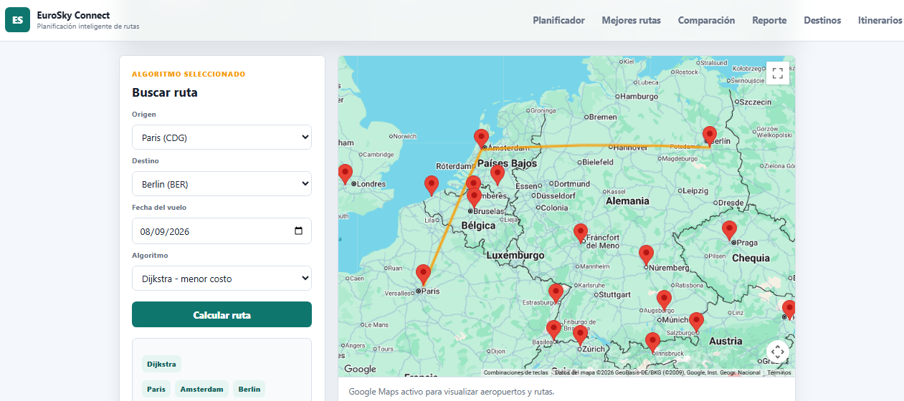
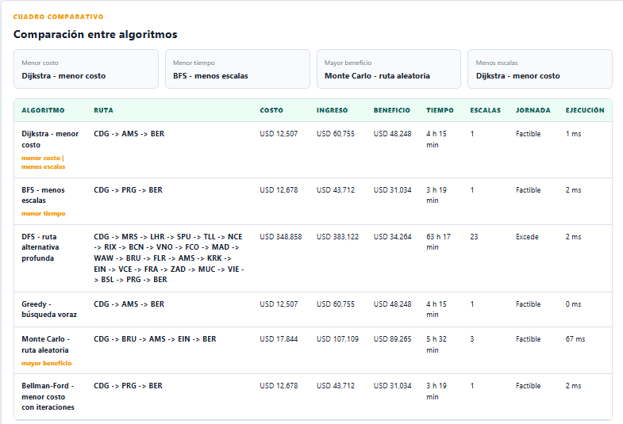

[English](README.md) · [Español](README.es.md)

# EuroSky Connect

Planificador de rutas aéreas europeas que compara **seis algoritmos de grafos** sobre una red real de aeropuertos y evalúa cada ruta por costo, tiempo, escalas y rentabilidad.

[](https://github.com/Pameladelarada/Caso-EuroSky-Connect/actions/workflows/ci.yml)






---

## Qué resuelve

Una aerolínea europea necesita decidir **qué rutas operar** y **con qué aeronave**, respetando una jornada máxima de 480 minutos y maximizando el beneficio neto por vuelo.

El sistema modela la red como un **grafo dirigido y ponderado** donde:

- **Nodos** → 36 aeropuertos europeos con coordenadas reales
- **Aristas** → 534 rutas operables
- **Peso** → costo total del tramo = `costo_operativo + tasa_aeroportuaria`

Sobre ese grafo corren seis algoritmos y se comparan lado a lado, para mostrar que *"la mejor ruta" depende de qué se optimice*.

| Algoritmo | Qué garantiza | Complejidad |
|---|---|---|
| **Dijkstra** | Costo mínimo real (pesos no negativos) | `O((V+E) log V)` |
| **Bellman-Ford** | Costo mínimo + detecta ciclos negativos | `O(V·E)` |
| **BFS** | Mínimo número de escalas | `O(V+E)` |
| **DFS** | Cualquier ruta conectada, no óptima | `O(V+E)` |
| **Greedy** | Heurística: prioriza el mejor tramo inmediato | `O((V+E) log V)` |
| **Monte Carlo** | Aproximación por muestreo aleatorio | `O(k·V)` |

---

## Qué encontré

Ejecuté los seis algoritmos sobre **240 pares origen-destino** y comparé los resultados. Tres cosas merecen contarse.

**Encontrar una ruta no es lo mismo que encontrar una que se pueda volar.** DFS devuelve siempre una ruta conectada, y **el 98 % de esas rutas excede la jornada de 480 minutos**. Promedia 12,9 escalas frente a las 0,3 de Dijkstra, con un costo 31 veces mayor. Conectividad y operabilidad son preguntas distintas, y un algoritmo que solo responde la primera no sirve aquí.

**Minimizar el costo no es maximizar el beneficio.** Monte Carlo nunca es más barato que Dijkstra (0 % de los pares, que es justo lo que predice la optimalidad), y sin embargo devuelve una ruta *más rentable* en el **90 %** de ellos. El ingreso se acumula por tramo, así que la ruta más rentable es la más larga que todavía cabe en la jornada — casi lo contrario de la más barata. Decidir qué optimizar es una decisión de negocio, no algorítmica.

**La heurística basta aquí, y por eso hace falta la exacta.** Greedy iguala el costo óptimo de Dijkstra en el **91 %** de los pares. En esta red el atajo casi siempre funciona; en el 9 % restante no, y sin el algoritmo exacto no hay forma de saber en cuál de los dos casos estás.

La más barata y la más rápida también divergen, aunque menos de lo que esperaba: el **13 %** de los pares.

*Método: `/api/comparacion` sobre todos los pares ordenados entre los primeros 16 aeropuertos; 240 pares con ruta bajo los seis algoritmos. Reproducible con el servidor levantado.*

---

## Arquitectura

El proyecto tiene **dos implementaciones deliberadamente paralelas** de los mismos algoritmos:

```
┌────────────────────────┐      ┌────────────────────────┐
│   Motor C++ (CLI)      │      │  Servidor Node/Express │
│                        │      │                        │
│  Implementación        │      │  Misma lógica en JS +  │
│  académica de los      │      │  API REST + fechas +   │
│  algoritmos desde cero │      │  conversión a PEN      │
└───────────┬────────────┘      └───────────┬────────────┘
            │                               │
            └───────────┬───────────────────┘
                        ▼
                  ┌──────────┐
                  │data.json │  ← fuente de verdad compartida
                  └──────────┘
                        ▲
            ┌───────────┴────────────┐
            │  data_sources/         │
            │  OurAirports (9 056)   │  ← enriquecimiento
            │  OpenFlights (67 663)  │
            └────────────────────────┘
```

**Por qué dos motores:** el binario C++ es el entregable académico, con los algoritmos implementados a mano y sin librerías de grafos. El servidor Node expone la misma lógica por HTTP para la interfaz web con Google Maps. Ambos leen `data.json`, así que los resultados son comparables.

### Archivos principales

```
main.cpp                  Menú CLI del motor C++
Grafo.h / .cpp            Construcción del grafo desde data.json
Algoritmos.h / .cpp       Dijkstra, BFS, DFS y utilidades compartidas
greedy.h                  Heurística greedy
montecarlo.h              Muestreo aleatorio
bellmanford.h             Bellman-Ford con detección de ciclos negativos
CostoRentabilidad.h/.cpp  Fórmulas de costo total y beneficio neto
json.hpp                  nlohmann/json — dependencia de terceros

server.js                 API Express
public/                   Frontend: HTML, CSS y JS sin framework

data.json                 Aeropuertos, rutas, aeronaves e itinerarios
data_sources/             CSV y DAT de OurAirports y OpenFlights
tests/                    Pruebas del motor C++ y de la API
Makefile                  Compilación y pruebas del motor C++
```

---

## Cómo ejecutarlo

### Requisitos

- **Node.js 18+**
- **g++ 9+** o **clang 10+** con soporte C++17
- Una API key de Google Maps *(opcional: sin ella todo funciona salvo el mapa)*

### 1. Servidor web

```bash
npm install
cp .env.example .env        # y pega tu GOOGLE_MAPS_API_KEY
npm start
```

Abre **http://localhost:3000**

### 2. Motor C++ (CLI)

```bash
make          # compila a build/eurosky
make run      # compila y ejecuta
```

En Windows con PowerShell, sin `make`:

```powershell
.\build.ps1
```

### 3. Pruebas

```bash
npm test      # 17 pruebas de la API
make test     # 30 pruebas del motor C++
```

Las dos suites corren automáticamente en cada push y en cada pull request
([GitHub Actions](.github/workflows/ci.yml)): el motor C++ se compila y se prueba en Linux y macOS,
y la API se prueba contra Node 18, 20 y 22. El workflow incluye además dos
pruebas de regresión sobre el binario ya compilado, para las dos fallas de
entrada que el proyecto tuvo.

No hacen falta dependencias de terceros: las pruebas del motor usan solo la
biblioteca estándar de C++ y las de la API el runner nativo `node:test`.

---

## API

| Método | Endpoint | Descripción |
|---|---|---|
| `GET` | `/api/resumen` | Conteo de aeropuertos, rutas, aeronaves y fuentes cargadas |
| `GET` | `/api/aeropuertos` | Lista de aeropuertos con coordenadas |
| `POST` | `/api/aeropuertos` | Registra un aeropuerto: valida IATA, rango de lat/lng y duplicados |
| `GET` | `/api/aeronaves` | Flota disponible |
| `POST` | `/api/aeronaves` | Registra una aeronave: capacidad entre 1 y 255 |
| `GET` | `/ruta?inicio=1&fin=5&algoritmo=dijkstra` | Ruta óptima con un algoritmo |
| `GET` | `/api/comparacion?inicio=1&fin=5` | Los seis algoritmos comparados |
| `GET` | `/api/mejores-rutas` | Ranking comercial de rutas |
| `GET` | `/api/rutas-sugeridas` | Itinerarios turísticos precargados |

**Ejemplo:**

```bash
curl "http://localhost:3000/api/comparacion?inicio=1&fin=20&fecha=2026-03-15"
```

Devuelve un arreglo con los seis algoritmos, cada uno con su secuencia de aeropuertos, costo, tiempo, escalas y beneficio neto, además de un bloque `destacados` que marca cuál gana en cada criterio.

---

## Modelo de negocio

**Costo total del tramo**

```
CT = costo_operativo + tasa_aeroportuaria
```

**Beneficio neto**

```
BN = ingreso_proyectado − CT
```

**Restricción operativa**

```
tiempo_vuelo + tiempo_escala ≤ 480 min   (jornada máxima)
```

Los montos se muestran en USD y en PEN.

---

## Fuentes de datos

| Fuente | Registros | Uso |
|---|---|---|
| [OurAirports](https://ourairports.com/data/) | 9 056 aeropuertos | Coordenadas, tipo, país ISO |
| [OpenFlights](https://openflights.org/data.html) | 67 663 rutas | Conectividad real entre aeropuertos |
| `data.json` | 36 aeropuertos / 534 rutas | Datos operativos del caso |

Las rutas del caso se enriquecen con conectividad real de OpenFlights: 448 rutas adicionales se derivan de las fuentes externas y 42 rutas del JSON llevan demanda calculada a partir de ellas.

---

## Decisiones técnicas

- **Sin librerías de grafos.** Los seis algoritmos están implementados desde cero. Es el punto del ejercicio: entender el costo real de cada estructura de datos.
- **JSON como almacenamiento.** Suficiente para el volumen del caso. Para producción haría falta una base de datos: el archivo se reescribe completo en cada `POST`.
- **Frontend sin framework.** HTML, CSS y JS plano, para mantener el foco en los algoritmos y no en el tooling.
- **Escapado en el cliente y validación en el servidor.** El detalle de destino se renderiza con plantillas, así que los campos de texto que vienen de la API se escapan antes de insertarse en el DOM y se validan al entrar.
- **`json.hpp` incluido en el repositorio.** Es la librería nlohmann/json en un solo header. Va versionada para que el proyecto compile sin instalar nada.

---

## Limitaciones conocidas

- El grafo es **dirigido**: `A → B` no implica `B → A`. Las rutas piloto simulan ida y vuelta consultando ambos sentidos.
- Monte Carlo es **no determinista**: dos ejecuciones pueden dar rutas distintas.
- Los aeropuertos que se registran desde el menú del CLI (opciones 1 a 5) viven en una estructura aparte y todavía no se integran al grafo que usan los algoritmos.
- La demanda esperada es un dato del caso, no una predicción.

---

## Licencia

MIT — ver [LICENSE](LICENSE).

Datos de OurAirports (dominio público) y OpenFlights (ODbL).
